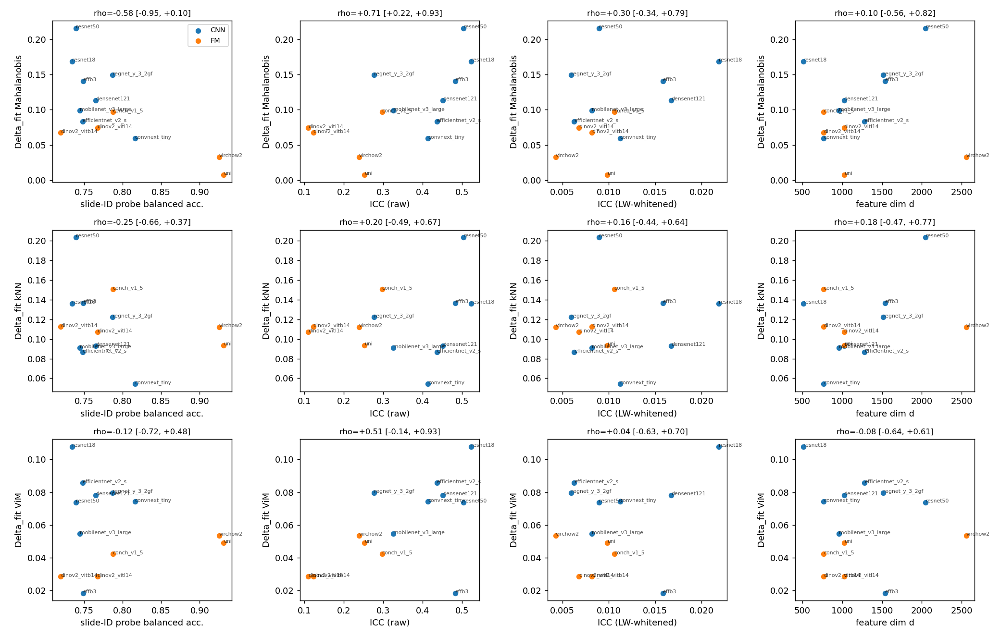

# R3 item 3: mechanism follow-up (Camelyon, 13 backbones, 30 slides, seed 42)

commit: 9b39bcd

Delta_fit = Track A seed-42 same - disjoint AUROC per scorer (n_groups_fit = 15 slides per fold, K = 2). ID accuracy is not defined per backbone for the probe-free feature scorers; the slide-ID probe accuracy is the model-side column.

## Per backbone

| model | kind | feat_dim | slide_probe_bacc | icc | icc_raw_mean | icc_whitened_mean | shrinkage_fold0 | shrinkage_fold1 | dfit_Mahalanobis | dfit_kNN | dfit_ViM | dfit_feature_median |
|---|---|---|---|---|---|---|---|---|---|---|---|---|
| convnext_tiny | CNN | 768 | 0.816 | 0.413 | 0.442 | 0.011 | 0.000 | 0.000 | 0.059 | 0.054 | 0.074 | 0.059 |
| densenet121 | CNN | 1024 | 0.765 | 0.451 | 0.474 | 0.017 | 0.000 | 0.000 | 0.113 | 0.093 | 0.078 | 0.093 |
| effb3 | CNN | 1536 | 0.749 | 0.482 | 0.496 | 0.016 | 0.000 | 0.000 | 0.140 | 0.136 | 0.018 | 0.136 |
| efficientnet_v2_s | CNN | 1280 | 0.748 | 0.436 | 0.455 | 0.006 | 0.000 | 0.000 | 0.083 | 0.086 | 0.086 | 0.086 |
| mobilenet_v3_large | CNN | 960 | 0.744 | 0.325 | 0.353 | 0.008 | 0.000 | 0.000 | 0.099 | 0.091 | 0.055 | 0.091 |
| regnet_y_3_2gf | CNN | 1512 | 0.787 | 0.277 | 0.298 | 0.006 | 0.000 | 0.000 | 0.149 | 0.122 | 0.080 | 0.122 |
| resnet18 | CNN | 512 | 0.735 | 0.523 | 0.544 | 0.022 | 0.000 | 0.000 | 0.168 | 0.136 | 0.108 | 0.136 |
| resnet50 | CNN | 2048 | 0.739 | 0.503 | 0.524 | 0.009 | 0.000 | 0.000 | 0.216 | 0.203 | 0.074 | 0.203 |
| conch_v1_5 | FM | 768 | 0.787 | 0.297 | 0.339 | 0.011 | 0.000 | 0.000 | 0.097 | 0.150 | 0.042 | 0.097 |
| dinov2_vitb14 | FM | 768 | 0.720 | 0.123 | 0.160 | 0.008 | 0.000 | 0.000 | 0.067 | 0.112 | 0.028 | 0.067 |
| dinov2_vitl14 | FM | 1024 | 0.767 | 0.110 | 0.135 | 0.007 | 0.000 | 0.000 | 0.074 | 0.107 | 0.029 | 0.074 |
| uni | FM | 1024 | 0.931 | 0.252 | 0.280 | 0.010 | 0.000 | 0.000 | 0.008 | 0.093 | 0.049 | 0.049 |
| virchow2 | FM | 2560 | 0.925 | 0.239 | 0.292 | 0.004 | 0.000 | 0.000 | 0.033 | 0.112 | 0.053 | 0.053 |

## Tests (every test run)

| # | part | y | x | n | rho | perm p | boot 95% CI | partial rho (CNN/FM) | rho CNN (n=8) | rho FM (n=5) |
|---|---|---|---|---|---|---|---|---|---|---|
| 1 | a | dfit_Mahalanobis | slide_probe_bacc | 13 | -0.582 | 0.0350 | [-0.949, +0.096] | -0.477 | -0.548 | -0.600 |
| 2 | a | dfit_Mahalanobis | icc | 13 | +0.709 | 0.0096 | [+0.216, +0.927] | +0.378 | +0.548 | +0.000 |
| 3 | b | dfit_Mahalanobis | icc_whitened_mean | 13 | +0.302 | 0.3172 | [-0.335, +0.794] | +0.145 | +0.190 | +0.300 |
| 4 | d | dfit_Mahalanobis | feat_dim | 13 | +0.100 | 0.7446 | [-0.557, +0.815] | +0.058 | +0.405 | -0.580 |
| 5 | a | dfit_kNN | slide_probe_bacc | 13 | -0.247 | 0.4155 | [-0.659, +0.373] | -0.322 | -0.500 | -0.500 |
| 6 | a | dfit_kNN | icc | 13 | +0.203 | 0.5015 | [-0.486, +0.668] | +0.516 | +0.619 | +0.300 |
| 7 | b | dfit_kNN | icc_whitened_mean | 13 | +0.159 | 0.6102 | [-0.440, +0.641] | +0.208 | +0.262 | +0.300 |
| 8 | d | dfit_kNN | feat_dim | 13 | +0.178 | 0.5565 | [-0.473, +0.772] | +0.191 | +0.571 | -0.632 |
| 9 | a | dfit_ViM | slide_probe_bacc | 13 | -0.121 | 0.6967 | [-0.715, +0.484] | +0.168 | -0.119 | +0.900 |
| 10 | a | dfit_ViM | icc | 13 | +0.505 | 0.0799 | [-0.145, +0.932] | -0.007 | +0.095 | +0.500 |
| 11 | b | dfit_ViM | icc_whitened_mean | 13 | +0.044 | 0.8931 | [-0.630, +0.703] | -0.194 | +0.024 | -0.200 |
| 12 | d | dfit_ViM | feat_dim | 13 | -0.083 | 0.7941 | [-0.640, +0.605] | -0.178 | -0.429 | +0.738 |

Verdict: smallest permutation p over 12 tests = 0.0096 (dfit_Mahalanobis vs icc, rho +0.709); no multiplicity correction applied.

Caveats: n = 13 backbones (FM n = 5); post-hoc, not preregistered; all 12 tests listed above.
