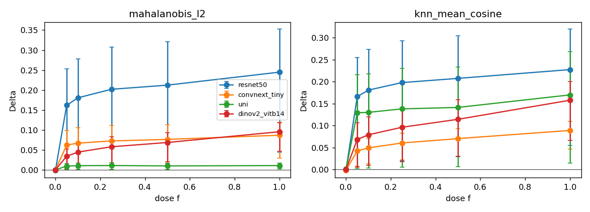

# R3 item 6: dose-response (Camelyon, post-hoc)

commit: 433126a

K = 2 folds (dose / unseen swapped); slides per set A / B / C = 9 / 9 / 12 (C = filler).

Split stratified within hospital: training hospitals in sets A / B / C = [0, 3, 4] / [0, 3, 4] / [0, 3, 4] (each hospital's slides cut 3 / 3 / 4), so Delta(f) does not mix in a hospital shift.

| model | d | ID acc | scorer | f | Delta | 95% CI | n_fit (fold 0, 1) | n_groups_fit (fold 0, 1) | Delta(0) CI contains 0 |
|---|---|---|---|---|---|---|---|---|---|
| resnet50 | 2048 | 0.995 | mahalanobis_l2 | 0.00 | -0.0009 | [-0.0019, +0.0006] | [70500, 108174] | [12, 12] | yes |
| resnet50 | 2048 | 0.995 | knn_mean_cosine | 0.00 | -0.0004 | [-0.0024, +0.0034] | [70500, 108174] | [12, 12] | yes |
| resnet50 | 2048 | 0.995 | mahalanobis_l2 | 0.05 | +0.1617 | [+0.0039, +0.2524] | [70500, 108174] | [21, 21] | yes |
| resnet50 | 2048 | 0.995 | knn_mean_cosine | 0.05 | +0.1659 | [+0.0076, +0.2551] | [70500, 108174] | [21, 21] | yes |
| resnet50 | 2048 | 0.995 | mahalanobis_l2 | 0.10 | +0.1804 | [+0.0058, +0.2784] | [70500, 108174] | [21, 21] | yes |
| resnet50 | 2048 | 0.995 | knn_mean_cosine | 0.10 | +0.1808 | [+0.0129, +0.2734] | [70500, 108174] | [21, 21] | yes |
| resnet50 | 2048 | 0.995 | mahalanobis_l2 | 0.25 | +0.2018 | [+0.0085, +0.3079] | [70500, 108174] | [21, 21] | yes |
| resnet50 | 2048 | 0.995 | knn_mean_cosine | 0.25 | +0.1980 | [+0.0196, +0.2937] | [70500, 108174] | [21, 21] | yes |
| resnet50 | 2048 | 0.995 | mahalanobis_l2 | 0.50 | +0.2121 | [+0.0138, +0.3206] | [70500, 108174] | [21, 21] | yes |
| resnet50 | 2048 | 0.995 | knn_mean_cosine | 0.50 | +0.2075 | [+0.0286, +0.3046] | [70500, 108174] | [21, 21] | yes |
| resnet50 | 2048 | 0.995 | mahalanobis_l2 | 1.00 | +0.2447 | [+0.0441, +0.3526] | [70500, 108174] | [9, 9] | yes |
| resnet50 | 2048 | 0.995 | knn_mean_cosine | 1.00 | +0.2276 | [+0.0553, +0.3199] | [70500, 108174] | [9, 9] | yes |
| convnext_tiny | 768 | 0.997 | mahalanobis_l2 | 0.00 | +0.0003 | [-0.0001, +0.0005] | [70500, 108174] | [12, 12] | yes |
| convnext_tiny | 768 | 0.997 | knn_mean_cosine | 0.00 | -0.0015 | [-0.0025, +0.0004] | [70500, 108174] | [12, 12] | yes |
| convnext_tiny | 768 | 0.997 | mahalanobis_l2 | 0.05 | +0.0620 | [+0.0029, +0.0990] | [70500, 108174] | [21, 21] | yes |
| convnext_tiny | 768 | 0.997 | knn_mean_cosine | 0.05 | +0.0422 | [+0.0076, +0.0627] | [70500, 108174] | [21, 21] | yes |
| convnext_tiny | 768 | 0.997 | mahalanobis_l2 | 0.10 | +0.0669 | [+0.0051, +0.1049] | [70500, 108174] | [21, 21] | yes |
| convnext_tiny | 768 | 0.997 | knn_mean_cosine | 0.10 | +0.0492 | [+0.0127, +0.0707] | [70500, 108174] | [21, 21] | yes |
| convnext_tiny | 768 | 0.997 | mahalanobis_l2 | 0.25 | +0.0723 | [+0.0095, +0.1110] | [70500, 108174] | [21, 21] | yes |
| convnext_tiny | 768 | 0.997 | knn_mean_cosine | 0.25 | +0.0604 | [+0.0214, +0.0827] | [70500, 108174] | [21, 21] | yes |
| convnext_tiny | 768 | 0.997 | mahalanobis_l2 | 0.50 | +0.0762 | [+0.0152, +0.1132] | [70500, 108174] | [21, 21] | yes |
| convnext_tiny | 768 | 0.997 | knn_mean_cosine | 0.50 | +0.0704 | [+0.0296, +0.0929] | [70500, 108174] | [21, 21] | yes |
| convnext_tiny | 768 | 0.997 | mahalanobis_l2 | 1.00 | +0.0867 | [+0.0291, +0.1191] | [70500, 108174] | [9, 9] | yes |
| convnext_tiny | 768 | 0.997 | knn_mean_cosine | 1.00 | +0.0890 | [+0.0463, +0.1093] | [70500, 108174] | [9, 9] | yes |
| uni | 1024 | 0.994 | mahalanobis_l2 | 0.00 | -0.0000 | [-0.0003, +0.0001] | [70500, 108174] | [12, 12] | yes |
| uni | 1024 | 0.994 | knn_mean_cosine | 0.00 | +0.0007 | [-0.0015, +0.0019] | [70500, 108174] | [12, 12] | yes |
| uni | 1024 | 0.994 | mahalanobis_l2 | 0.05 | +0.0094 | [+0.0005, +0.0154] | [70500, 108174] | [21, 21] | yes |
| uni | 1024 | 0.994 | knn_mean_cosine | 0.05 | +0.1292 | [+0.0027, +0.2161] | [70500, 108174] | [21, 21] | yes |
| uni | 1024 | 0.994 | mahalanobis_l2 | 0.10 | +0.0103 | [+0.0007, +0.0169] | [70500, 108174] | [21, 21] | yes |
| uni | 1024 | 0.994 | knn_mean_cosine | 0.10 | +0.1302 | [+0.0038, +0.2177] | [70500, 108174] | [21, 21] | yes |
| uni | 1024 | 0.994 | mahalanobis_l2 | 0.25 | +0.0107 | [+0.0011, +0.0181] | [70500, 108174] | [21, 21] | yes |
| uni | 1024 | 0.994 | knn_mean_cosine | 0.25 | +0.1381 | [+0.0051, +0.2298] | [70500, 108174] | [21, 21] | yes |
| uni | 1024 | 0.994 | mahalanobis_l2 | 0.50 | +0.0098 | [+0.0014, +0.0167] | [70500, 108174] | [21, 21] | yes |
| uni | 1024 | 0.994 | knn_mean_cosine | 0.50 | +0.1414 | [+0.0064, +0.2336] | [70500, 108174] | [21, 21] | yes |
| uni | 1024 | 0.994 | mahalanobis_l2 | 1.00 | +0.0106 | [+0.0017, +0.0173] | [70500, 108174] | [9, 9] | yes |
| uni | 1024 | 0.994 | knn_mean_cosine | 1.00 | +0.1699 | [+0.0143, +0.2679] | [70500, 108174] | [9, 9] | yes |
| dinov2_vitb14 | 768 | 0.972 | mahalanobis_l2 | 0.00 | +0.0001 | [-0.0000, +0.0003] | [70500, 108174] | [12, 12] | yes |
| dinov2_vitb14 | 768 | 0.972 | knn_mean_cosine | 0.00 | +0.0002 | [-0.0006, +0.0012] | [70500, 108174] | [12, 12] | yes |
| dinov2_vitb14 | 768 | 0.972 | mahalanobis_l2 | 0.05 | +0.0341 | [+0.0028, +0.0515] | [70500, 108174] | [21, 21] | yes |
| dinov2_vitb14 | 768 | 0.972 | knn_mean_cosine | 0.05 | +0.0683 | [+0.0051, +0.1065] | [70500, 108174] | [21, 21] | yes |
| dinov2_vitb14 | 768 | 0.972 | mahalanobis_l2 | 0.10 | +0.0444 | [+0.0059, +0.0657] | [70500, 108174] | [21, 21] | yes |
| dinov2_vitb14 | 768 | 0.972 | knn_mean_cosine | 0.10 | +0.0791 | [+0.0090, +0.1198] | [70500, 108174] | [21, 21] | yes |
| dinov2_vitb14 | 768 | 0.972 | mahalanobis_l2 | 0.25 | +0.0577 | [+0.0117, +0.0823] | [70500, 108174] | [21, 21] | yes |
| dinov2_vitb14 | 768 | 0.972 | knn_mean_cosine | 0.25 | +0.0962 | [+0.0179, +0.1394] | [70500, 108174] | [21, 21] | yes |
| dinov2_vitb14 | 768 | 0.972 | mahalanobis_l2 | 0.50 | +0.0685 | [+0.0198, +0.0935] | [70500, 108174] | [21, 21] | yes |
| dinov2_vitb14 | 768 | 0.972 | knn_mean_cosine | 0.50 | +0.1143 | [+0.0296, +0.1586] | [70500, 108174] | [21, 21] | yes |
| dinov2_vitb14 | 768 | 0.972 | mahalanobis_l2 | 1.00 | +0.0954 | [+0.0459, +0.1176] | [70500, 108174] | [9, 9] | yes |
| dinov2_vitb14 | 768 | 0.972 | knn_mean_cosine | 1.00 | +0.1577 | [+0.0661, +0.2004] | [70500, 108174] | [9, 9] | yes |

## Delta(1) beside Track A Delta_fit and item-1 Delta (for context only)

Different split (three-way, fixed fit size) from Track A and item 1 (H11c 2-fold), so this is not a check.

| model | scorer | Delta(1) | Track A Delta_fit | item-1 Delta |
|---|---|---|---|---|
| resnet50 | mahalanobis_l2 | +0.2447 | +0.2156 | +0.2156 |
| resnet50 | knn_mean_cosine | +0.2276 | +0.2033 | +0.2033 |
| convnext_tiny | mahalanobis_l2 | +0.0867 | +0.0593 | +0.0593 |
| convnext_tiny | knn_mean_cosine | +0.0890 | +0.0541 | +0.0541 |
| uni | mahalanobis_l2 | +0.0106 | +0.0077 | +0.0077 |
| uni | knn_mean_cosine | +0.1699 | +0.0933 | +0.0933 |
| dinov2_vitb14 | mahalanobis_l2 | +0.0954 | +0.0673 | +0.0673 |
| dinov2_vitb14 | knn_mean_cosine | +0.1577 | +0.1123 | +0.1123 |

Verdict: Delta(0) CI contains 0 in 8/8 model x scorer rows (rows failing the sanity check are STOP).

Caveats: post-hoc (not in precommit); three-way slide split (dose / unseen / filler, stratified within hospital) instead of the Track A 15 / 15 split, so Delta(1) is not the Track A estimand.
