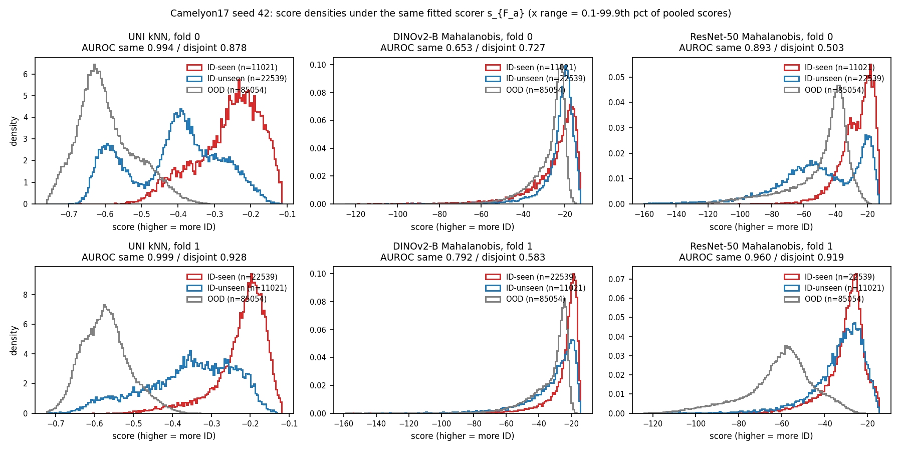

# R4 analysis 2: score-distribution decomposition of Eq. 1 (EXPLORATORY, post hoc)

Commit at report time: `a2dee75`. Not in any precommit.

**Verdict:** the OOD scores are identical in both AUROC terms (diff 0) in all 28 backbone x scorer x fold cases, so Delta comes entirely from the ID side. The ID-seen median lies above the ID-unseen median in 27 of 28 cases (shift -0.10 to +0.85 IQR).

Source: cached Track C scores, Camelyon17, seed 42 (`outputs/rigor_pack/miccai_campaign/scores/camelyon_*.npz`).
Under the scorer fitted on training fold a: ID-seen = id_val patches of fold-a slides, ID-unseen = id_val patches of fold-(1-a) slides, and OOD = hospital-2 patches.
Higher score = more ID. Shift = (median ID-seen - median ID-unseen) / IQR(ID-unseen).

## Checks

- The OOD scores entering the two AUROC terms are the same vector in every backbone x scorer x fold: max abs diff = 0.0e+00.
  For contrast, OOD scores differ between the two folds' fits by up to 114 (max over cells).
- The recomputed fold-mean AUROCs equal the cells json `same_2fold` / `disjoint_2fold`: max abs diff 0.0e+00 / 0.0e+00 (tolerance 1e-12).

## Shift and AUROC terms

| backbone | scorer | fold | n_groups_fit | K | d | ID acc | AUROC same | AUROC disjoint | Delta (2-fold mean) | shift (IQR units) |
|---|---|---|---|---|---|---|---|---|---|---|
| uni | Mahalanobis | 0 | 15 | 2 | 1024 | 0.9944 | 0.9994 | 0.9945 | 0.0077 | +0.68 |
| uni | Mahalanobis | 1 | 15 | 2 | 1024 | 0.9944 | 0.9995 | 0.9890 | 0.0077 | +0.74 |
| uni | kNN | 0 | 15 | 2 | 1024 | 0.9944 | 0.9939 | 0.8776 | 0.0933 | +0.76 |
| uni | kNN | 1 | 15 | 2 | 1024 | 0.9944 | 0.9985 | 0.9282 | 0.0933 | +0.82 |
| virchow2 | Mahalanobis | 0 | 15 | 2 | 2560 | 0.9948 | 0.9909 | 0.9801 | 0.0325 | +0.46 |
| virchow2 | Mahalanobis | 1 | 15 | 2 | 2560 | 0.9948 | 0.9911 | 0.9367 | 0.0325 | +0.48 |
| virchow2 | kNN | 0 | 15 | 2 | 2560 | 0.9948 | 0.9665 | 0.8725 | 0.1121 | +0.42 |
| virchow2 | kNN | 1 | 15 | 2 | 2560 | 0.9948 | 0.9742 | 0.8441 | 0.1121 | +0.49 |
| dinov2_vitb14 | Mahalanobis | 0 | 15 | 2 | 768 | 0.9717 | 0.6526 | 0.7270 | 0.0673 | -0.10 |
| dinov2_vitb14 | Mahalanobis | 1 | 15 | 2 | 768 | 0.9717 | 0.7917 | 0.5827 | 0.0673 | +0.36 |
| dinov2_vitb14 | kNN | 0 | 15 | 2 | 768 | 0.9717 | 0.6662 | 0.6732 | 0.1123 | +0.16 |
| dinov2_vitb14 | kNN | 1 | 15 | 2 | 768 | 0.9717 | 0.8177 | 0.5860 | 0.1123 | +0.39 |
| dinov2_vitl14 | Mahalanobis | 0 | 15 | 2 | 1024 | 0.9765 | 0.6904 | 0.7499 | 0.0741 | +0.02 |
| dinov2_vitl14 | Mahalanobis | 1 | 15 | 2 | 1024 | 0.9765 | 0.8229 | 0.6153 | 0.0741 | +0.36 |
| dinov2_vitl14 | kNN | 0 | 15 | 2 | 1024 | 0.9765 | 0.7055 | 0.7165 | 0.1073 | +0.22 |
| dinov2_vitl14 | kNN | 1 | 15 | 2 | 1024 | 0.9765 | 0.8527 | 0.6271 | 0.1073 | +0.37 |
| conch_v1_5 | Mahalanobis | 0 | 15 | 2 | 768 | 0.9873 | 0.8329 | 0.8125 | 0.0970 | +0.27 |
| conch_v1_5 | Mahalanobis | 1 | 15 | 2 | 768 | 0.9873 | 0.9003 | 0.7267 | 0.0970 | +0.42 |
| conch_v1_5 | kNN | 0 | 15 | 2 | 768 | 0.9873 | 0.9552 | 0.7849 | 0.1505 | +0.42 |
| conch_v1_5 | kNN | 1 | 15 | 2 | 768 | 0.9873 | 0.9705 | 0.8399 | 0.1505 | +0.47 |
| resnet50 | Mahalanobis | 0 | 15 | 2 | 2048 | 0.9954 | 0.8930 | 0.5033 | 0.2156 | +0.61 |
| resnet50 | Mahalanobis | 1 | 15 | 2 | 2048 | 0.9954 | 0.9605 | 0.9191 | 0.2156 | +0.19 |
| resnet50 | kNN | 0 | 15 | 2 | 2048 | 0.9954 | 0.8629 | 0.5280 | 0.2033 | +0.45 |
| resnet50 | kNN | 1 | 15 | 2 | 2048 | 0.9954 | 0.8937 | 0.8219 | 0.2033 | +0.40 |
| convnext_tiny | Mahalanobis | 0 | 15 | 2 | 768 | 0.9969 | 0.9151 | 0.8586 | 0.0593 | +0.16 |
| convnext_tiny | Mahalanobis | 1 | 15 | 2 | 768 | 0.9969 | 0.9543 | 0.8922 | 0.0593 | +0.85 |
| convnext_tiny | kNN | 0 | 15 | 2 | 768 | 0.9969 | 0.8792 | 0.8477 | 0.0541 | +0.05 |
| convnext_tiny | kNN | 1 | 15 | 2 | 768 | 0.9969 | 0.9506 | 0.8739 | 0.0541 | +0.79 |

## Quantiles (5 / 25 / 50 / 75 / 95)

| backbone | scorer | fold | ID-seen | ID-unseen | OOD |
|---|---|---|---|---|---|
| uni | Mahalanobis | 0 | -42.85 / -35.44 / -30.69 / -27.17 / -23.26 | -51.28 / -45.07 / -38.34 / -33.9 / -27.18 | -66.38 / -62.75 / -59.74 / -56.46 / -52.36 |
| uni | Mahalanobis | 1 | -45.19 / -33.84 / -29.98 / -27.29 / -24.66 | -57.12 / -46.85 / -39.17 / -34.49 / -29.76 | -74.5 / -68.88 / -66.01 / -63.55 / -60.34 |
| uni | kNN | 0 | -0.4342 / -0.3149 / -0.2446 / -0.1929 / -0.1396 | -0.6198 / -0.5272 / -0.3993 / -0.3227 / -0.2202 | -0.7121 / -0.6513 / -0.6099 / -0.547 / -0.4437 |
| uni | kNN | 1 | -0.366 / -0.2482 / -0.2068 / -0.178 / -0.1454 | -0.5813 / -0.4342 / -0.3452 / -0.266 / -0.1971 | -0.6622 / -0.6144 / -0.5738 / -0.5343 / -0.4594 |
| virchow2 | Mahalanobis | 0 | -82.74 / -59.18 / -44.92 / -33.76 / -25.51 | -90.95 / -74.37 / -57.82 / -46.47 / -33.98 | -145.5 / -122.6 / -109.3 / -98.8 / -86.44 |
| virchow2 | Mahalanobis | 1 | -84.86 / -54.11 / -42.52 / -35.94 / -30.06 | -121.6 / -83.45 / -61.06 / -44.76 / -35.65 | -169.5 / -142.4 / -122.5 / -107 / -92.51 |
| virchow2 | kNN | 0 | -0.2231 / -0.1409 / -0.08345 / -0.05355 / -0.02238 | -0.297 / -0.2183 / -0.1367 / -0.09197 / -0.05789 | -0.4127 / -0.3329 / -0.2807 / -0.2331 / -0.1713 |
| virchow2 | kNN | 1 | -0.1742 / -0.09285 / -0.0623 / -0.0442 / -0.02917 | -0.2799 / -0.1918 / -0.12 / -0.074 / -0.04908 | -0.4081 / -0.3224 / -0.2402 / -0.188 / -0.1414 |
| dinov2_vitb14 | Mahalanobis | 0 | -49.35 / -29.03 / -21.34 / -17.24 / -14.08 | -39.42 / -24.56 / -20.7 / -18.07 / -14.76 | -46.12 / -31.19 / -24.72 / -21.88 / -19.28 |
| dinov2_vitb14 | Mahalanobis | 1 | -48.18 / -26.37 / -21.06 / -18.32 / -15.93 | -66.65 / -37.91 / -27.15 / -21.04 / -16.95 | -59.63 / -38.81 / -28.67 / -24.73 / -21.81 |
| dinov2_vitb14 | kNN | 0 | -0.1572 / -0.06861 / -0.0407 / -0.02816 / -0.01829 | -0.1144 / -0.05761 / -0.04449 / -0.03417 / -0.01987 | -0.1489 / -0.08396 / -0.05424 / -0.04399 / -0.03356 |
| dinov2_vitb14 | kNN | 1 | -0.1045 / -0.04118 / -0.02878 / -0.02257 / -0.01663 | -0.1651 / -0.07644 / -0.04695 / -0.02984 / -0.01896 | -0.152 / -0.08323 / -0.05062 / -0.04019 / -0.0325 |
| dinov2_vitl14 | Mahalanobis | 0 | -60.66 / -30.75 / -22.54 / -18.59 / -15.49 | -41.94 / -26.47 / -22.69 / -19.94 / -16.37 | -62.9 / -35.74 / -27.48 / -24.27 / -21.24 |
| dinov2_vitl14 | Mahalanobis | 1 | -54.5 / -28.52 / -23.2 / -20.34 / -17.94 | -87.74 / -41.8 / -29.71 / -23.67 / -19.24 | -87.74 / -47.22 / -32.82 / -28.2 / -24.81 |
| dinov2_vitl14 | kNN | 0 | -0.1048 / -0.03373 / -0.01875 / -0.01343 / -0.00953 | -0.05912 / -0.02759 / -0.02116 / -0.0165 / -0.01071 | -0.1194 / -0.04754 / -0.02774 / -0.02217 / -0.01746 |
| dinov2_vitl14 | kNN | 1 | -0.05564 / -0.01863 / -0.01337 / -0.01085 / -0.008606 | -0.1134 / -0.03734 / -0.02169 / -0.01458 / -0.01005 | -0.1232 / -0.04754 / -0.02585 / -0.02024 / -0.01647 |
| conch_v1_5 | Mahalanobis | 0 | -37.8 / -29 / -23.95 / -19.5 / -15.38 | -36.15 / -30.03 / -26.05 / -22.29 / -16.4 | -40.99 / -34.25 / -31.62 / -29.65 / -27.2 |
| conch_v1_5 | Mahalanobis | 1 | -39.63 / -28.03 / -23.93 / -21.13 / -17.82 | -48.04 / -35.65 / -29.05 / -23.46 / -18.38 | -49.58 / -39.56 / -34.68 / -31.88 / -29.26 |
| conch_v1_5 | kNN | 0 | -0.1097 / -0.07215 / -0.05158 / -0.03388 / -0.02171 | -0.1675 / -0.1165 / -0.07853 / -0.05297 / -0.02792 | -0.1824 / -0.1487 / -0.1258 / -0.1057 / -0.08336 |
| conch_v1_5 | kNN | 1 | -0.08989 / -0.05327 / -0.03981 / -0.03191 / -0.02223 | -0.1429 / -0.09044 / -0.06257 / -0.04231 / -0.02548 | -0.1697 / -0.1317 / -0.1112 / -0.09438 / -0.07528 |
| resnet50 | Mahalanobis | 0 | -46.2 / -32.3 / -24.27 / -18.58 / -14.37 | -99.25 / -65.76 / -48.69 / -25.42 / -16.8 | -92.59 / -55.61 / -42.38 / -36.6 / -29.23 |
| resnet50 | Mahalanobis | 1 | -48.96 / -33.72 / -28.13 / -24.47 / -18.2 | -58.51 / -38.52 / -30.72 / -24.96 / -19.07 | -93.68 / -68.93 / -58.91 / -50.98 / -36.83 |
| resnet50 | kNN | 0 | -0.01773 / -0.005894 / -0.003287 / -0.002079 / -0.001138 | -0.06508 / -0.02239 / -0.01119 / -0.004687 / -0.001925 | -0.08221 / -0.01841 / -0.009986 / -0.006943 / -0.004491 |
| resnet50 | kNN | 1 | -0.01651 / -0.005292 / -0.002805 / -0.001824 / -0.001141 | -0.0237 / -0.007914 / -0.004801 / -0.002981 / -0.001521 | -0.08077 / -0.01932 / -0.01136 / -0.008152 / -0.004767 |
| convnext_tiny | Mahalanobis | 0 | -44.08 / -32.06 / -25.37 / -19.26 / -13.06 | -52.85 / -35.14 / -27.54 / -21.73 / -17.6 | -63.19 / -51.12 / -42.95 / -37.54 / -31.69 |
| convnext_tiny | Mahalanobis | 1 | -49.32 / -32.82 / -21.37 / -14.78 / -11.32 | -57.36 / -42.61 / -34.13 / -27.58 / -17.8 | -76.99 / -63.9 / -54.38 / -47.24 / -38.92 |
| convnext_tiny | kNN | 0 | -0.1611 / -0.09498 / -0.06041 / -0.03141 / -0.01199 | -0.1986 / -0.103 / -0.06377 / -0.03886 / -0.02497 | -0.4225 / -0.2251 / -0.1471 / -0.1054 / -0.07349 |
| convnext_tiny | kNN | 1 | -0.1362 / -0.06628 / -0.02944 / -0.0142 / -0.008013 | -0.1798 / -0.1104 / -0.07644 / -0.05056 / -0.02356 | -0.4447 / -0.2531 / -0.1674 / -0.121 / -0.08138 |

Figure: UNI kNN, DINOv2-B Mahalanobis and ResNet-50 Mahalanobis; rows = fold 0 / fold 1; step histograms (150 bins, density).

Full table: `results/r4/2/quantiles.csv`.

Caveats: post hoc and descriptive (no CI); one seed; quantiles pool patches, so slides with many patches weigh more.
