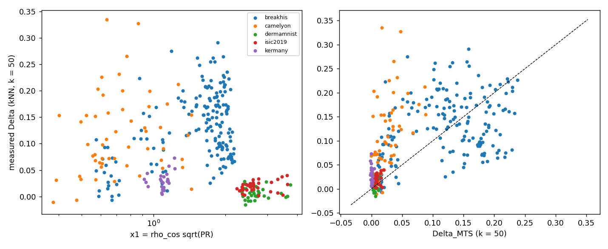
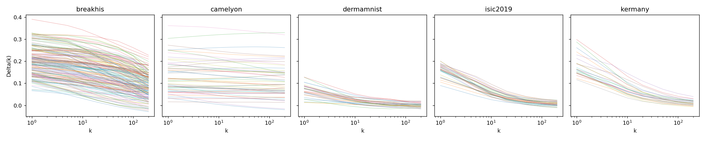

# Item B — kNN leakage on real features (REPORT)

**Verdict: NO-GO** (B-i fail, B-ii fail). Consequence written in the order: no ρ√d statement about kNN on real features is made;
kNN leakage stays empirical.

- Precommit commit `e326d392fd42ced26fbebe6c0a38ed983267d187`; work list `results/t1/PRECOMMIT_T1_addendum_B.json` (158 cells; all executed).
- GPU-hours (sacct, elapsed × 1 GPU, job 65297, 4 tasks): 0.98 + 1.25 + 0.85 + 1.40 = **4.49** vs estimate 6–12, cap 18.
- Implementation check: own Δ_meas(k = 50) vs the R3 item-1 `knn_mean_cosine` strict-seen Δ over all 158 cells: max |diff| = 9.7e-17.

## Status words

| sub-criterion | status | numbers (Camelyon LOBO, 13 backbones, k = 50) |
|---|---|---|
| B-i (collapse) | fail | R²_oos of the isotonic x₁ = ρ̂_cos√PR map = **−0.269** (bar > 0); mean D_b vs B1 (isotonic ρ̂_cos) = −0.0071 [−0.0171, 0.0027] (bar: LB > 0) |
| B-ii (MTS) | fail | MAE(MTS) = 0.0888 vs MAE(B1) = 0.0195 (bar: below B1); mean D_b = −0.069 [−0.088, −0.050] (bar: LB > 0) |

Both comparisons against a linear B1 (report only) fail too (DB-2).

## Camelyon LOBO (k = 50)

| predictor | MAE | R²_oos vs B0 | Spearman |
|---|---|---|---|
| B0 (mean) | 0.0229 | 0.000 | — |
| iso x₁ = ρ̂_cos√PR | 0.0266 | −0.269 | −0.07 |
| iso x₂ = ρ̂_cos√d | 0.0221 | −0.116 | −0.36 |
| iso x₃ = ρ̂_cos√TwoNN | 0.0256 | −0.331 | −0.63 |
| B1 iso ρ̂_cos | 0.0195 | 0.094 | −0.13 |
| iso d/N | 0.0205 | 0.074 | −0.04 |
| iso d | 0.0205 | 0.074 | −0.04 |
| iso T_unseen | 0.0280 | −0.341 | −0.35 |
| linear ρ̂_cos | 0.0238 | −0.073 | −0.68 |
| MTS (zero real-fit parameters) | 0.0888 | −10.55 | 0.05 |
| iso r_NN(50) (mechanistic reference) | 0.0252 | −0.188 | −0.91 |

No predictor explains the spread of Δ across the 13 Camelyon backbones clearly better than the mean; the best (isotonic ρ̂_cos,
R²_oos 0.09) is the ICC-only baseline. The Camelyon Δ_meas(k = 50) range is 0.067–0.162 over backbones.

## MTS vs measured (all cells, report)

| block | cell × folds | MAE | mean Δ_meas | mean Δ_MTS | Spearman |
|---|---|---|---|---|---|
| all cells | 316 | 0.054 | 0.095 | 0.072 | 0.69 |
| Camelyon | 54 | 0.091 | 0.117 | 0.027 | 0.51 |

The matched toy simulator ranks cells across datasets reasonably (Spearman 0.69 over all 316 cell × folds) but under-predicts
Camelyon by a factor of about 4 (0.027 vs 0.117) and does not resolve the between-backbone differences inside Camelyon,
which is what B-ii tests.

## Collapse over all cells × k ≤ n_g (report; LOBO by backbone, 18 backbones, 1,344 points)

| map | MAE | R²_oos |
|---|---|---|
| iso x₁ | 0.059 | 0.063 |
| iso x₂ | 0.062 | 0.027 |
| iso x₃ | 0.064 | −0.047 |
| iso ρ̂_cos | 0.060 | 0.074 |
| iso d | 0.066 | −0.079 |

Left: Δ(k = 50) against x₁ for every cell × fold, coloured by dataset. dermamnist and isic2019 have the largest x₁ and Δ ≈ 0:
their groups have about one image each, so k = 50 is far above n_g (the per-k drop below). Right: Δ_MTS vs Δ_meas.

## Per-k sensitivity (report)

- k ≤ n_g (224 cell × folds with at least three such k; least-squares slope): median slope of Δ_meas(k) per unit log k = −0.0127 (Δ declines slowly with k rather than being exactly flat).
- Cells with median n_g < 100 and at least one k on each side of n_g (testable; 262 cell × folds): Δ_meas averaged over k > n_g is below the average over k ≤ n_g in **99.2 %**, as K4 predicts.

## Files

`cells_knn.csv` (cell × fold descriptors and Δ), `perk.csv` (Δ_meas(k) and r_NN(k)), `collapse_lobo.csv`, `mts.csv`, `b_backbones.csv`,
`tests.csv`, `b_summary.json`, `verdict.json`, `collapse.png`, `perk.png`, `DEVIATIONS.md` (DB-1 … DB-9).
